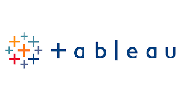

# Bridging Software Development and Data Analytics

### Experience:
#### Zee Learn Ltd 
- #### Junior Software Developer  
  _Nov 2024 – Present • 2 mosn_ 
- #### Data Analyst & Software Developer (Internship)  
  _Jan 2024 – Oct 2024 • 10 mos_
  
### Education:
- Master's degree in Big Data Analytics 
- Bachelor’s degree in Computer Science.

### Achievments
- Enhanced business decision-making by 35% with the creation of interactive dashboards and reports.
- Informed strategic decision-making with a 40% accuracy improvement in sales trend predictions.
- Streamlined operations and improved customer interaction by 25% with a customizable chatbot.
- Improved the file management efficiency and accuracy by 45% with automated file uploads to AWS S3.
- Identified potential applications for future projects with a 30% improvment in understanding image text recognition technology.
- Enabled efficient data retrieval  and analysis with a 50% improvement in data processing through web scraping and database intergration.

### Skills 
                  

 
