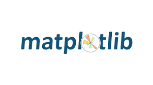

# Transforming Data into Business Insights

### Experience:
#### Zee Learn Ltd 
- #### Data Analyst  
  _Nov 2024 – Present • 2 mos_ 
- #### Data Analyst (Internship)  
  _Jan 2024 – Oct 2024 • 10 mos_
  
### Education:
- Master's degree in Big Data Analytics 
- Bachelor’s degree in Computer Science.

### Achievments
- Revolutionized the Kidzee admission process by automating CRM integration and analytics, boosting operational efficiency by over **70% and enabling seamless data-driven decision-making.**
- Enhanced business decision-making by **35% with the creation of interactive dashboards and reports.**
- Informed strategic decision-making with a **40% accuracy improvement in sales trend predictions.**
- Streamlined operations and improved customer interaction by **25% with a customizable chatbot.**
- Improved the file management efficiency and accuracy by **45% with automated file uploads to AWS S3.**
- Identified potential applications for future projects with a **30% improvment in understanding image text recognition technology.**
- Enabled efficient data retrieval  and analysis with a **50% improvement in data processing through web scraping and database intergration.**

### College Projects
- **Data Visualization:** Collaborated on data visualization of RFM and CLV to analyse customer behaviour of RFM and CLV to analyze customer behaviour and value, using visualization techniques to communicate insights for marketing and customer engagement.
- **Econometrics Assignment:** Developed a financial report on Balarampur Chini Mills, conducted portfolio analysis of various companies using financial models and risk metrics, and explored financial time series data from IndusInd Bank to gain stock performance insights and make data-driven observations.
- **Emotion Detection using CNN:** Implemented a CNN-based face emotion detection system with real-time capabilities using OpenCV and achieved high accuracy through thorough data preprocessing, while also utilizing advanced clustering, factor analysis, and dimensionality reduction techniques for personal trait predictions using Big 5 model.
- **Machine Learning:** Developed a machine learning model to predict travel insurance purchase decisions using various algorithms, feature engineering, and data preprocessing techniques.

### Skills 
                  

 
